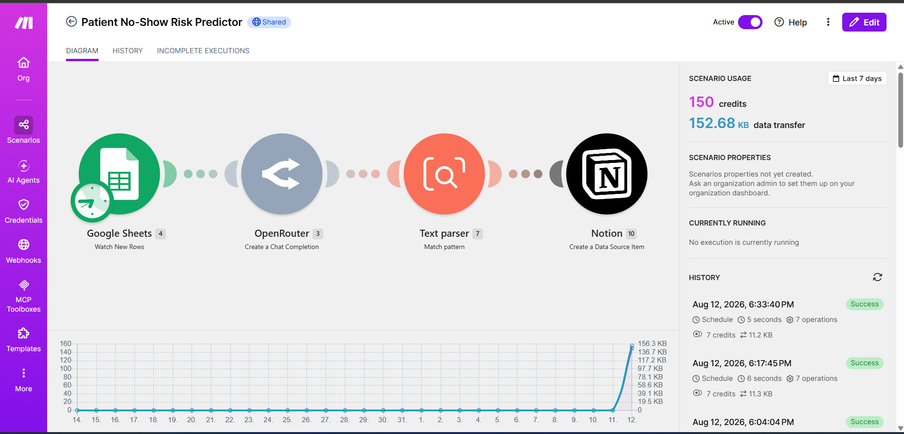
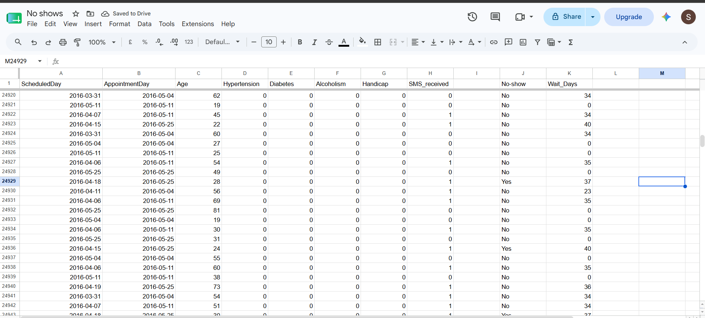
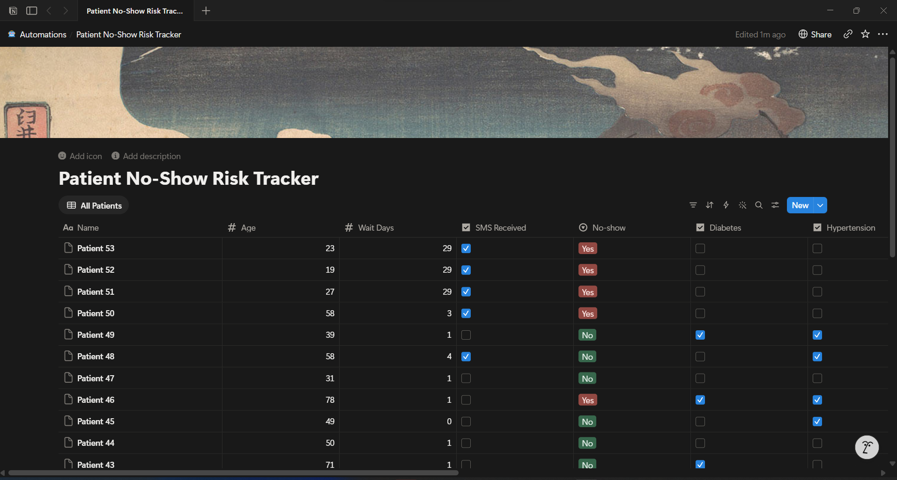
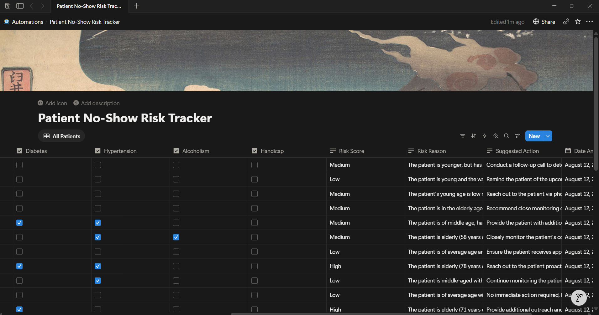

# Patient No-Show Risk Predictor

An AI-powered automation that predicts patient no-show risk using **Make.com, Claude AI, Google Sheets, and Notion** — built entirely no-code.

## 📸 Screenshots

### Automation Workflow

### Google Sheets Input Data

### Notion Results

## 🚀 What It Does

- Ingests patient appointment data from Google Sheets
- Analyzes risk factors using Claude AI
- Outputs a Risk Score (High/Medium/Low) with explanation
- Logs results to Notion for clinical review

## 📊 Input Data

| Field | Description |
|-------|-------------|
| Age | Patient age |
| Wait Days | Days between scheduling and appointment |
| SMS Received | Whether patient got a reminder |
| No-show | Previous no-show history |
| Diabetes | Chronic condition flag |
| Hypertension | Chronic condition flag |
| Alcoholism | Health factor |
| Handicap | Accessibility factor |

## 📤 Output

Each patient gets:
- **Risk Score:** High / Medium / Low
- **Risk Reason:** 1-sentence explanation
- **Suggested Action:** 1-sentence intervention

## 🔧 How to Use

1. **Import the Blueprint** into Make.com (`Scenarios > Import Blueprint`)
2. **Connect your accounts:** Google Sheets, OpenRouter (Claude), Notion
3. **Set up your data** in Google Sheets with the required columns
4. **Run the scenario**

## 🛠️ Tech Stack

- Make.com (orchestration)
- Claude AI (risk analysis)
- Google Sheets (data source)
- Notion (output dashboard)
- OpenRouter (Claude API access)

## 📁 Repository Contents

| File | Description |
|------|-------------|
| `patient-no-show-risk-predictor.blueprint.json` | The Make.com scenario export |
| `make-scenario.png` | Automation workflow preview |
| `google-sheets-input.png` | Sample input data |
| `Notion-results1.png` | Notion output dashboard |
| `notion-results2.png` | Notion results detail |

## 📌 Requirements

- Make.com account
- OpenRouter API key (free tier available)
- Google Sheets with patient data
- Notion account (free tier works)

## 📝 License

MIT
